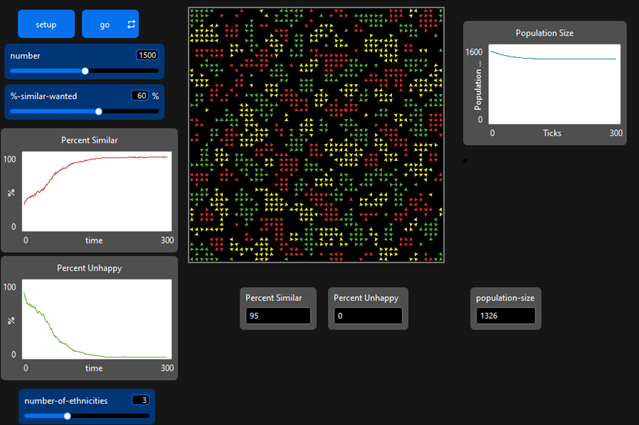
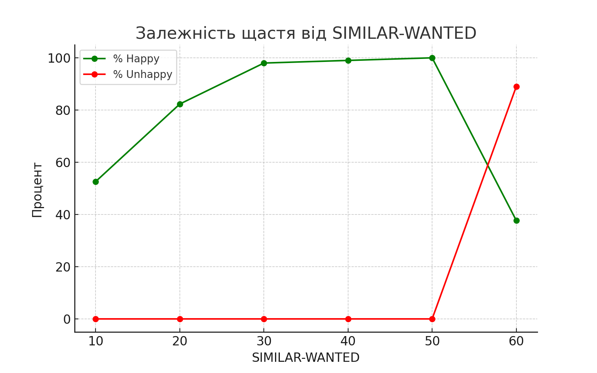
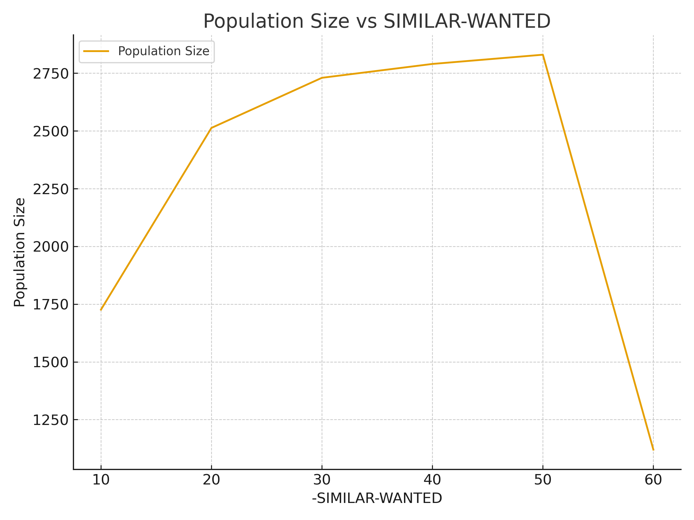

## Комп'ютерні системи імітаційного моделювання
## СПм-24-3, **Коваленко Данило Андрійович**
### Лабораторна робота №**2**. Редагування імітаційних моделей у середовищі NetLogo
 

### Варіант 8, модель у середовищі NetLogo:
[Segregation Simple Extension 1](http://www.netlogoweb.org/launch#http://www.netlogoweb.org/assets/modelslib/IABM%20Textbook/chapter%203/Segregation%20Extensions/Segregation%20Simple%20Extension%201.nlogo)

 

## Внесені зміни у вихідну логіку моделі, за варіантом:
### 1. Додано можливість зникнення агентів (новий поведінковий механізм)

У початковій моделі агенти ніколи не зникали - вони лише рухалися, доки не ставали «щасливими».
У модифікованій логіці введено нову процедуру maybe-disappear, яка дозволяє агентам зникати за певних умов:

- поруч занадто багато «чужих» сусідів

- немає жодного вільного патчу для переселення.

<pre> to maybe-disappear
  ask turtles [
    let foreign-neighbors total-nearby - similar-nearby
    if total-nearby > 0 [
      let disappear-probability foreign-neighbors / total-nearby
      let free-patch neighbors with [not any? turtles-here]
      if not any? free-patch [
        if random-float 1 < disappear-probability [
          die
        ]
      ]
    ]]
end </pre>

Завдяки цьому модель отримує новий тип динаміки — часткове або повне вимирання популяції.

---

### 2. Додано нову глобальну змінну population-size

У модифікованій версії додано змінну population-size, яка постійно оновлюється:

<pre> set population-size count turtles </pre>

Це дозволяє будувати графік зміни чисельності популяції, для подальшого аналізу її розвитку.

---

### 3. Змінено логіку переміщення агентів

У початковій моделі рух відбувався випадковим способом: агент повертався на випадковий кут, рухався вперед на випадкову відстань до 10, якщо місце зайняте — повторював спробу.

У зміненій версії вводиться пошук вільних сусідніх патчів:

<pre> to find-new-spot
  let free-patches neighbors with [not any? turtles-here]
  ifelse any? free-patches [
    move-to one-of free-patches
  ] [
    rt random-float 360
    fd 1
  ]
end </pre>

Тобто агент намагається раціонально переселитися поруч, а не рухається хаотично.
Хаотичний рух використовується лише як резервний варіант.

---

### 4. Змінено процедуру go

У розробленій версії додано нові механізми:

контроль на зникнення агентів,

перевірка на повне вимирання популяції, щоб уникнути помилки ділення на нуль.

Новий порядок:
<pre> move-unhappy-turtles 
update-turtles 
maybe-disappear 
update-globals </pre>

Перевірка на вимирання:
<pre> if count turtles = 0 [ stop ] </pre>

Це робить модель стійкішою та дозволяє досліджувати сценарії масового зникнення агентів.

Модель стала значно гнучкішою, реалістичнішою та інформативнішою.
Вона тепер не просто демонструє механізм сегрегації, а й дозволяє досліджувати стійкість соціальних систем, динаміку популяцій та умови колапсу.

Це перетворює модель зі статичної демонстрації на повноцінний інструмент аналітичних експериментів.

---

## Внесені зміни у вихідну логіку моделі, на власний розсуд:

### 1. Додано механізм соціального тиску (apply-social-pressure)

У базовій моделі «щастя» агента залежало лише від частки схожих сусідів.
Було додано нове правило соціальної взаємодії — вплив соціального тиску, правило, яке змушує агента ставати нещасливим, якщо навколо нього є достатньо сусідів, які вже нещасливі:

<pre> to apply-social-pressure
  ask turtles [
    let nearby turtles-on neighbors
    let unhappy-neighbors count nearby with [not happy?]

    if unhappy-neighbors >= 2 [
      set happy? false
    ]
  ]
end </pre>

Що це покращує:

- моделює ефект «негативних настроїв», що поширюються в групі;

- дозволяє досліджувати, як локальні «зони напруги» впливають на міграції та стабільність популяції.

--- 

###  2. Додано механізм накопичення «happy-streak»

Це важливе нововведення (лічильник щастя черепахи):

<pre> ifelse happy? [
  set happy-streak happy-streak + 1
] [
  set happy-streak 0
] </pre>

Що це додає:

- агент веде «лічильник щасливих кроків підряд»;

- тривале щастя → може викликати розмноження;

- дає дані для аналізу стабільності проживання;

---

### 3. Додано механізм розмноження агентів (reproduce-happy-turtles)

Щасливі агенти можуть породжувати нових turtle-агентів після довгого періоду стабільного щастя (50 тактів):

<pre> to reproduce-happy-turtles
  ask turtles with [happy-streak >= 50] [
    let free-spot one-of neighbors with [not any? turtles-here]
    if free-spot != nobody [
      hatch 1 [
        move-to free-spot
        set happy? true
        set happy-streak 0
      ]
    ]
    set happy-streak 0
  ]
end </pre>

Що це покращує:

- додає еволюцію та популяційне зростання;

- створює конкуренцію між народжуваністю та зникненням;

### 4. Перероблена процедура go

Новий порядок:

<pre> move-unhappy-turtles
update-turtles
apply-social-pressure
reproduce-happy-turtles
maybe-disappear
update-globals </pre>

Покращення:

- модель стала більш стійкою (перевірка на нульову популяцію);

- порядок логічно впорядковано за причинно-наслідковими звʼязками;

- додано кілька нових етапів поведінки.

---

### Розроблена модель має наступний вигляд:

## Обчислювальні експерименти:

### 1. Чутливість до порогу щастя
  
  **Мета:** визначити, наскільки модель чутлива до невеликих змін у порозі схожості.

  **Змінний параметр:**
    %-SIMILAR-WANTED = [10, 20, 30, 40, 50, 60]

 **Постійні параметри:**
    number = 1800, number-of-ethnicities = 3

**Основне завдання експерименту:** виявити та кількісно охарактеризувати критичний інтервал значень параметра %-similar-wanted, при якому модель переходить від стабільної/мішаної поведінки до режимів масового вимирання або сильної сегрегації. Іншими словами — визначити, чи існує «порогова зона».

  <table>
    <thead>
    <tr><th>-SIMILAR-WANTED</th><th>Percent happy</th><th>Percent Unhappy</th><th>Population Size</th></tr>
    </thead>
    <tbody>
    <tr><td>10</td><td>52.6</td><td>0</td><td>1726</td></tr>
    <tr><td>20</td><td>82.3</td><td>0</td><td>2513</td></tr>
    <tr><td>30</td><td>98</td><td>0</td><td>2730</td></tr>
    <tr><td>40</td><td>99</td><td>0</td><td>2790</td></tr>
    <tr><td>50</td><td>100</td><td>0</td><td>2830</td></tr>
    <tr><td>60</td><td>37.7</td><td>89</td><td>1120</td></tr>
    </tbody>
  </table>

  

  

  **Аналіз результатів:**

  - Для низьких значень %-similar-wanted (10–50) більшість агентів щасливі, population-size зростає, а відсоток нещасливих близький до 0.

  - При %-similar-wanted = 60 відбувається різкий колапс: відсоток нещасливих стрімко зростає до 89%, а population-size падає майже вдвічі.

    Це демонструє фазовий перехід: модель чутлива до невеликого збільшення порогу щастя — невелике підвищення %-similar-wanted різко знижує стабільність системи.

**Висновок:** Існує критична зона приблизно між 50–60%, де навіть невеликі зміни порогу щастя можуть призвести до масового невдоволення та зменшення популяції.